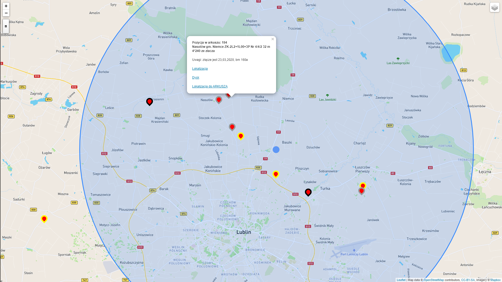

# Frontend w Angularze

Ten projekt został wygenerowany za pomocą [Angular CLI](https://github.com/angular/angular-cli) wersji 9.1.0.

## Serwer programistyczny

Uruchomić `ng serve` dla serwera deweloperskiego. Nawigować do `http://localhost:4200/`.
Aplikacja zostanie automatycznie ponownie załadowana, jeśli zmienisz dowolny plik źródłowy.

## Budowanie

Uruchomić `ng build` budowanie projektu wersji deweloperskiej. \n
Artefakty kompilacji będą przechowywane w `dist/`. Użyj `--prod` flaga kompilacji produkcyjnej.

## Pierwsze kroki

Do uruchomienia programu wymagane jest utworzenie zmiennych środowiskowych `config` oraz `configURLGoogleSheets`.

